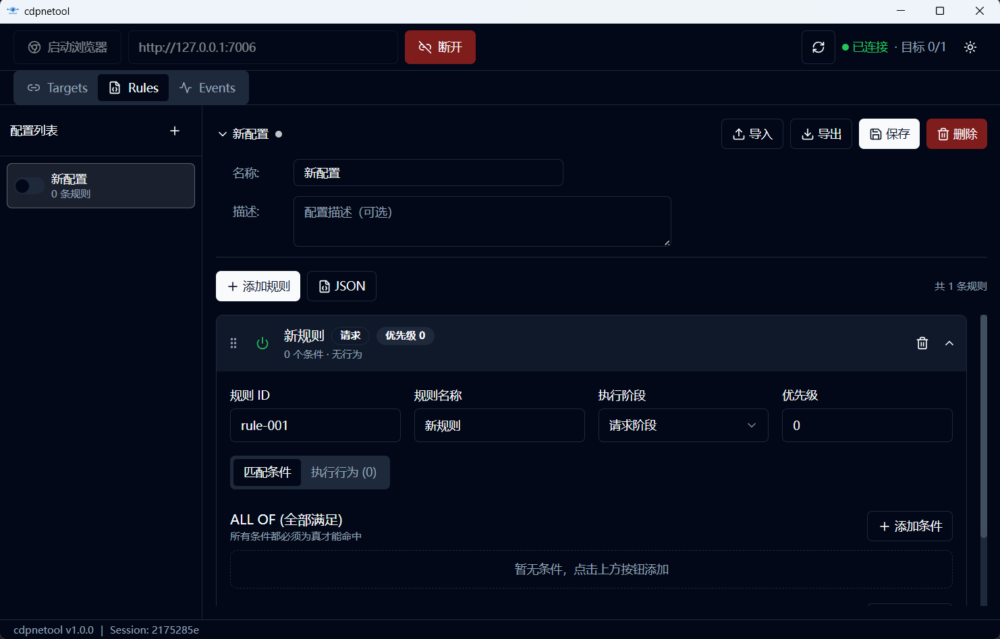

# cdpnetool

<p align="center">
  
</p>

> 基于 Chrome DevTools Protocol 的网络请求拦截与修改工具

<p align="center">
  
</p>

[](LICENSE)
[](https://github.com/241x/cdpnetool/releases)

## 简介

cdpnetool 是一款强大的网络请求拦截工具，通过 Chrome DevTools Protocol 实现对浏览器 HTTP/HTTPS 请求的精准控制和灵活修改。无需安装证书，无需编写代码，通过可视化界面即可完成复杂的网络调试任务。

**核心特性：**
- ✅ 实时拦截浏览器网络请求和响应
- ✅ 可视化规则配置，支持丰富的匹配条件和修改行为
- ✅ 配置管理：多配置保存、导入导出、快速切换
- ✅ 事件监控：DevTools 风格的详情面板
- ✅ 无需证书：基于 CDP 协议直接控制浏览器

## 快速开始

### 安装

**Windows 用户：**

从 [Releases](https://github.com/241x/cdpnetool/releases) 下载最新版本的安装包并运行。

**其他平台：**

macOS 和 Linux 平台需要从源码构建，详见 [文档](./docs/02-quick-start.md#从源码构建)。

### 基本使用

1. 启动 cdpnetool
2. 点击「启动浏览器」按钮
3. 点击「连接」连接到浏览器
4. 在 Targets 面板附加要拦截的页面
5. 在 Rules 面板创建规则并启用配置
6. 在浏览器中触发请求，在 Events 面板查看结果

## 文档

- [项目介绍](./docs/01-introduction.md) - 了解 cdpnetool 的功能和适用场景
- [快速开始](./docs/02-quick-start.md) - 5 分钟上手教程
- [规则配置参考](./docs/03-rule-reference.md) - 完整的规则语法参考
- [常见问题](./docs/04-faq.md) - 问题排查和解决方案

## 适用场景

- 🔧 **前端开发**：Mock API 数据、测试异常状态、调试跨域问题
- 🧪 **软件测试**：边界测试、错误模拟、安全测试
- 🔍 **接口调试**：拦截分析加密请求、修改参数探测行为
- 🎨 **个性化定制**：广告屏蔽、网络加速、功能增强

## 技术栈

- 前端：React + TypeScript + Vite + TailwindCSS
- 后端：Go + Wails v2
- 协议：Chrome DevTools Protocol (CDP)
- 数据库：SQLite

## 开发

```bash
# 克隆项目
git clone https://github.com/241x/cdpnetool.git
cd cdpnetool

# 安装 Wails CLI
go install github.com/wailsapp/wails/v2/cmd/wails@latest

# 开发模式运行
wails dev

# 构建生产版本
wails build
```

详细的开发说明请参考 [快速开始 - 从源码构建](./docs/02-quick-start.md#从源码构建)。

## 贡献

欢迎提交 Issue 和 Pull Request！

## 许可证

[GPL-3.0 License](LICENSE)

本项目采用 GNU General Public License v3.0 协议开源。

## 相关链接

- [Chrome DevTools Protocol](https://chromedevtools.github.io/devtools-protocol/)
- [Wails Framework](https://wails.io/)
